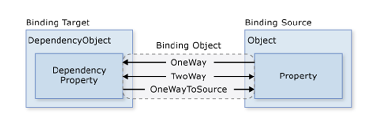

# MVVM


This documentation does not contain advanced information about MVVM. It only describes its basic concept, knowledge of which will be sufficient to get started with Catel and our application.


## What is MVVM?

The MVVM (Model-View-ViewModel) pattern allows you to separate the application logic from the visual part (representation). This pattern is architectural, that is, it defines the overall architecture of the application.

## Concept

The result of using the MVVM pattern is the functional division of the application into three components, which are easier to develop and test, as well as further modify and maintain.

These are the 3 components:

* **ViewModel**
* **Model**
* **View**

So developers can work separately from each other and do not need to know the subtleties of the **View** implementation to make logic in the **ViewModel**.


### ViewModel

A ViewModel binds a model and a view through a data binding mechanism. If property values change in the model, when the model implements the `INotifyPropertyChanged` interface, the displayed data in the view automatically changes, although the model and the view are not directly related.

Also, all the main code is located here. As a rule, the standard `.cs` file created together with the `.xaml` window is not used at all for code placement.

The ViewModel also contains logic for getting data from the model, which is then passed to the view. Also ViewModel defines the logic for updating data in the model and validation.

### Model

The Model describes the data used in the application. Models can contain logic directly related to this data, for example, the logic of validating model properties. At the same time, the model should not contain any logic related to data display and interaction with visual controls.

Often, the model implements the `INotifyPropertyChanged` or `INotifyCollectionChanged` interfaces, which allow notifying the system about changes in model properties. This makes it easier to bind to the view, although again there is no direct interaction between the model and the view.

In our application, all API responses containing entity data are deserialized in the model. You can find full list of models and model\`s properties in page below.


[models](models/)


### View

The View defines the visual interface through which the user interacts with the application. In relation to WPF, a view is a xaml code that defines an interface in the form of buttons, text fields, and other visual elements.

Although a window (Window class) in WPF can contain both an interface in xaml and C# code bound to it, however, ideally the C# code in file`.xaml.cs` should not contain any logic, except perhaps a constructor that calls the `InitializeComponent` method and performs the initial initialization of the window. All the basic logic of the application is transferred to the ViewModel component.

However, sometimes there may still be some logic in the linked code file that is difficult to implement within the MVVM pattern in the ViewModel.

The view does not handle events with rare exceptions, but performs actions mainly through commands.

Since the elements of the view, such as visual components like buttons, do not use events. The view interacts with the ViewModel through **commands**.

## Commands

MVVM uses commands to interact between the user and the application. This does not mean that we cannot use events and the event model at all, but wherever possible, commands should be used instead of events.

For example, a user wants to save the data entered in a text field. He clicks on the button and sends a command to the **ViewModel**. And the **ViewModel** already receives the transmitted data and updates the model according to them.


Basically, commands are most often used on buttons and similar interactive elements. As a result, they are most often responsible for clicking on an interactive element, however, Catel allows you to bind commands not only to a predefined event, but also to any available in the element.


For example, the simplest form binding commands:

```xml
<Menu>
    <MenuItem Header="Close app" Command="{Binding CloseApp}" />
</Menu>

...

<Button Content="Send form" Command="{Binding SendForm}" />
```

## Binding & INotifyPropertyChanged

Binding is a powerful programming tool that no serious application can do without.

Binding implies the interaction of two objects: a source and a receiver. The receiver object creates a binding to a specific property of the source object. In case of modification of the source object, the receiver object will also be modified.

For example, the simplest form using binding:

```xml
<StackPanel>
    <TextBox x:Name="myTextBox" Height="30" />

    <!-- Binding to element property -->
    <TextBox Text="{Binding ElementName=myTextBox,Path=Text}" Height="30" />

    <!-- Binding to property in ViewModel -->
    <TextBox Text="{Binding Text}" Height="30" />

    <!-- Binding to property in ViewModel and notify changes every time when property changes. -->
    <TextBox Text="{Binding Text, UpdateSourceTrigger=PropertyChanged}" Height="30" />

    <!-- Change TextBox text after Text property is changes in ViewModel. -->
    <TextBox Text="{Binding Text, Mode=OneWay}" Height="30" />
</StackPanel>
```

For MVMM, binding is one of the key features that no application could do without. To track changes in code properties, the `INotifyPropertyChanged` interface is used.

Usage examples will be covered later in the next sections.

### Binding mode

There are different types of binding:

**OneWay** The property of the _view_ changes after modifying the property in the _view model_.

**OneWayToSource** The _view_ in which the binding is declared changes the _view model_.

**OneTime** The property of the _view_ is set by the property of the _view model_ only once. In the future, changes in the _view model_ do not affect the _view_ in any way. Good for initial initialization from _view model._

**TwoWay** Both _view_ and _view model_ can change each other's bound properties.

**Default** The default value. User-editable properties such as TextBox.Text, etc have **TwoWay** as their default mode value, otherwise **OneWay**.



### UpdateSourceTrigger

One-way binding from the _view model_ to the _view_ almost instantly changes the property of the _view_. But if we use two-way binding in the case of text fields, then when the _view_ changes, the _view model_ property does not change instantly. This property takes as one of the values of the UpdateSourceTrigger enumeration:

**PropertyChanged** The property in _view model_ is updated immediately after the property is updated in _view_.

**LostFocus** The property in the _view model_ is updated only after the UI element loses focus.

**Explicit** The _view model_ is not updated until the `BindingExpression` method is called: `UpdateSource().` In other words, manual control.

**Default** The default value. For most properties, this is the **PropertyChanged** value. And for the Text property of the TextBox element, this is the **LostFocus** value.

### RelativeSource

The RelativeSource property allows you to set a binding relative to the source element. For example, the source element can be one of the external elements.

For example:


```xml
<equality:Page x:Class="Equality.Views.TeamMembersPage">
     <ListBox ItemsSource="{Binding FilteredMembers}">
        <ListBox.ItemTemplate>
            <!--
            DataContext inside this DataTemplate will be FilteredMembers item,
            so if we need bind to equality:Page DataContext, we should use
            RelativeSource.
            -->
            <DataTemplate>
                <!-- Binding to Name and JoinedAt properties in local DataContext(FilteredMembers item). -->
                <TextBlock Text="{Binding Name}" />
                <TextBlock Text="{Binding JoinedAt}" />

                <!--
                We specify current view in RelativeSource AncestorType and bind to the FollowUser
                command inside ViewModel(DataContext of the current ui element).
                When we write "{Binding}", we bind to the current DataContext.
                So CommandParameter here it is a local DataContext(FilteredMembers item).
                -->
                <Button Content="Follow"
                        Command="{Binding DataContext.FollowUser, RelativeSource={RelativeSource AncestorType=equality:Page}}"
                        CommandParameter="{Binding}" />
            </DataTemplate>
        </ListBox.ItemTemplate>
     </ListBox>
</equality:Page>
```



You can specify not only views in _AncestorType_, but also other elements and types.


## ObservableCollection

The **ObservableCollection** class is used for binding to collections of objects, which is located in the namespace `System.Collections.ObjectModel`. Its advantage is that with any change, the _ObservableCollection_ can notify the elements that apply the binding, as a result of which not only the _ObservableCollection_ object itself is updated, but also the interface elements bound to it.

Lets see example. Property `Phones` here is `ObservableCollection<Phone>.`

```xml
<ListBox ItemsSource="{Binding Phones}">
    <ListBox.ItemTemplate>
        <DataTemplate>
            <StackPanel Margin="5">
                <TextBlock FontSize="18" Text="{Binding Path=Title}" />
                <TextBlock Text="{Binding Path=Company}" />
                <TextBlock Text="{Binding Path=Price}" />
            </StackPanel>
        </DataTemplate>
    </ListBox.ItemTemplate>
</ListBox>
```

Usage examples will be covered later in the next sections.

## MVVM with Catel

See how to use MVVM with the Catel framework.


[catel-framework](catel-framework/)

